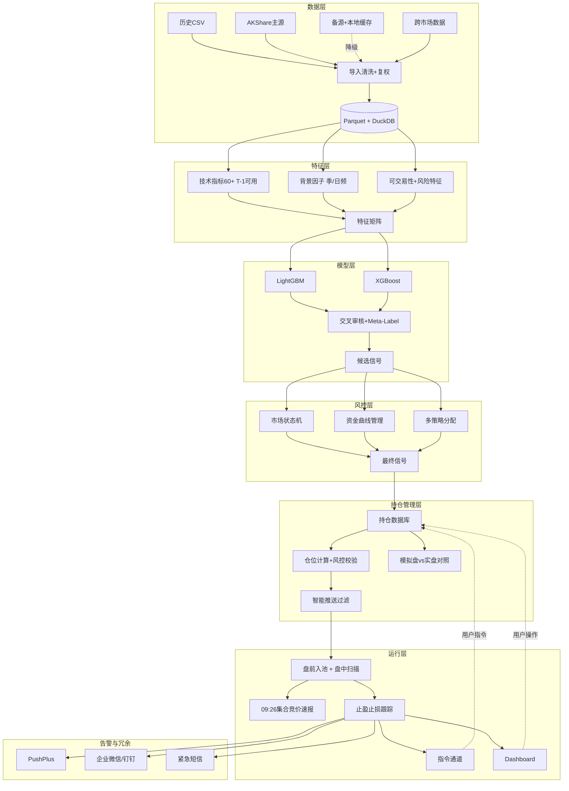

# A股量化分析系统实施方案 v7（最终版）

> 版本：2026-03-01 | 融合8份AI专业审核 + CODEX 5.3多轮整合 + Gemini终极修正

---

## 0. 修订历史

| 版本 | 关键变更 |
|------|---------|
| v4.1 | CODEX审核：双模型交叉审核、分数统一、SLA、涨跌停规则 |
| v4.2 | 深度审查：幸存者偏差、复权、特征泄露、过拟合检测等15项 |
| v5 | 主力追踪、喝汤策略、资金曲线、多策略、空仓信号、利润锁定 |
| v5.1 | 请求吞吐修正、交易时段拆分、点时一致性、熔断补齐、执行质量监控 |
| v5.2 | 持仓管理（双通道）、智能推送过滤、交易日志闭环 |
| v5.3 | 跨市场因子、竞价速报、模拟盘对照、异常事件预警、通知冗余、黑名单、标签对齐、回测撮合器 |
| v6 | 8份AI审核整合：动态滑点/仓位公式、因子生命周期、流动性门槛、监管因子、长假降仓、策略自毁、压力测试、止盈确认、云冷备 |
| v7 | Gemini终极大复盘：T日静音推送防扰、阴跌震荡压力测试场景补充 |

---

## 1. 目标与边界

### 1.1 目标
1. 10年A股数据训练模型，提炼高命中率上涨信号
2. 自动候选池 + 盘中监控 + 微信推送
3. 妖股捕捉：首板狙击 + 连板预测 + 龙头识别
4. **"喝汤"为主**：只做确认段，目标5-12%，严格5%止损
5. 风险闭环：资金曲线管理 + 多策略轮换 + 空仓信号
6. Mac Mini 24h运行

### 1.2 边界
- 辅助决策，不自动下单
- A股约束：T+1、涨跌停成交性、停牌、成本
- 回测与线上规则完全一致
- **系统用于个人研究，不构成投资建议**

### 1.3 适用资金规模（新增 — 千问）
- 推荐规模：50-200万
- <50万：分仓困难，但可减少max_holdings到2
- >200万：需关注冲击成本，自动提高流动性门槛

---

## 2. 系统架构



---

## 3. 数据源与容灾

### 3.1 主源：AKShare（免费）

| 用途 | 接口 | 频率 | 注意事项 |
|---|---|---|---|
| 历史日线 | `stock_zh_a_hist(adjust="qfq")` | 日 | **必须前复权** |
| 实时行情 | `stock_zh_a_spot_em()` | 盘中 | 批量≤2次/秒 |
| 分钟数据 | `stock_zh_a_hist_min_em()` | 盘中 | 历史仅5天，不可回测 |
| 资金流向 | `stock_individual_fund_flow()` | 日 | 背景因子 |
| 板块行情 | `stock_board_industry_*()` | 日/实时 | |
| 龙虎榜 | `stock_lhb_detail_em()` | 日 | N日后收益**禁入特征** |
| 涨停池 | `stock_zt_pool_em()` | 日 | |
| 股东人数 | `stock_zh_a_gdhs()` | 季 | 背景因子 |
| 大宗交易 | `stock_dzjy_mrmx()` | 日 | 背景因子 |
| 融资融券 | `stock_margin_detail_*()` | 日 | 背景因子 |
| 隔夜美股/A50/汇率/商品 | 备用行情源 | 日 | 盘前因子，不触发买入 |

### 3.2 涨跌停规则
- 优先用数据源返回的 `up_limit/down_limit`
- 兜底：主板±10%、ST±5%、科创/创业板±20%、北交所±30%
- 注册制新股前5日无涨跌幅限制
- **制度版本化**（CODEX修正）：回测中按日期适用历史制度规则
  - 科创板：2019-07-22起前5日不限涨跌幅，第6日起±20%
  - 创业板：2020-08-24起从±10%改为±20%（注册制改革）
  - 印花税：2023-08-28起从千1降为千0.5（财政部公告）
  - 涨跌停板块归属以当日制度为准，避免历史期误算可成交性

### 3.3 容灾
- 主源连续3次失败 → 切备源/缓存
- 请求频率（批次0.3-0.5s）+ 高峰期Redis缓存最近1分钟行情（Grok建议）
- 数据接口5分钟健康巡检（成功率/延迟/字段缺失）
- **数据降级=停新仓**（GPT提出的强规则）：延迟>120s或成功率<95% → 暂停新买入推送，仅保留风控提醒

### 3.4 数据质量修正
- 幸存者偏差：纳入退市股（需验证AKShare退市股覆盖率 — MiniMax）
- 复权：前复权训练 + 点时可得复权因子回测
- 禁止未来复权回填
- 借壳按新公司处理
- 停牌>5日复牌后前3天不纳入技术分析

### 3.5 跨市场盘前因子（08:30）
- 隔夜美股/A50/USDCNH/油铜金 → `global_risk_score` + `sector_bias`
- 仅微调阈值±2分和仓位±10%
- **跨市场因子动态衰减**（Grok）：若A股与A50近20日相关系数<0.45，该因子权重减半

---

## 4. 特征体系

### 4.1 实时触发特征（盘中可用）
- 技术指标（T-1日线）：MA/EMA/MACD/RSI/KDJ/BOLL/ATR/OBV等
- 量价：量比、换手率变化、涨跌幅
- 盘中：当前价位置、分时形态

### 4.2 背景因子（日/季频，不单独触发）
- 股东人数变化 → 筹码集中度
- 大宗交易 → 机构态度
- 融资融券趋势 → 市场情绪
- 解禁日程 → 风险减分
- 龙虎榜席位 → 游资关注度（**仅减分不加分** — MiniMax建议）
- **监管动态因子**（DS3.2）：被交易所问询/列入重点监控 → 自动降分或排除
  - v1落地：Dashboard手动维护灰名单 + 自动降分
  - v2落地：接入公告/监管信息源自动拓取
  - 缺失处理：无监管数据时不加分也不误杀，保持中性
- **可转债异动**（GLM5）：正股有可转债时，可转债T+0异动可作为先行指标
  - v1落地：手动关注，v2接AKShare可转债行情接口

### 4.3 建仓完成度评分（背景因子，权重≤20%）
```
completion_score = (
  0.30 * 股东人数减少率_norm +
  0.20 * 大宗连续买入_norm +
  0.15 * 底部横盘天数_norm +
  0.15 * 缩量程度_norm +
  0.10 * 融资趋势_norm +
  0.10 * 换手率降低_norm
)
```

### 4.4 防未来函数（硬规则）
- 盘前选股只能用T-1及之前数据
- 龙虎榜"N日后收益"禁入特征
- 当日换手率/涨停在收盘前为估算值须标注

### 4.5 集合竞价情报（09:15-09:25）
- 09:26生成竞价速报：高开风险/低开机会/板块竞价强度
- 仅调整优先级，不触发买入

### 4.6 流动性门槛（按策略拆分 — GPT 5.2修正）
```yaml
liquidity_filter_trend:               # 趋势/喝汤策略（严格）
  min_daily_turnover: 80000000       # 日均成交额>8000万
  min_float_market_cap: 8000000000   # 流通市值>80亿
  max_turnover_rate: 0.15            # 换手率<15%

liquidity_filter_monster:             # 妖股/首板策略（宽松，配合隔离风控）
  min_daily_turnover: 50000000       # 日均成交额>5000万
  min_float_market_cap: 3000000000   # 流通市值>30亿
  max_turnover_rate: 0.30            # 允许高换手（妖股特征）

# 冲击成本限制（按资金规模分档 — GPT 5.2修正）
impact_limit:
  capital_below_50w: 0.005
  capital_50w_200w: 0.003
  capital_above_200w: 0.001
```

### 4.7 财务风险过滤（新增 — GLM5）
```yaml
financial_filter:
  exclude_st: true                   # 排除ST/*ST
  exclude_delisting_risk: true       # 排除退市风险警示股
  min_roe: 0.03                      # ROE>3%（最近年报）
  max_debt_ratio: 0.75               # 资产负债率<75%
  # 数据来源：AKShare季报接口，每季度更新
  # 缺失时保守处理：无财报数据的股票不入候选池
  apply_to: [trend, oversold]        # 仅对趋势/超跌策略硬过滤
  monster_mode: score_penalty        # 妖股策略：不硬排除，改为降分-10（GPT 5.2修正）
```

---

## 5. 双模型交叉审核

### 5.1 训练
- LightGBM + XGBoost，Isotonic校准
- Walk-Forward滚动验证，禁止随机切分
- 类别不平衡：`scale_pos_weight` + 下采样
- **随机特征对照基线**（GLM5）：加入随机特征，模型不应赋予其显著权重
- **训练数据近期加权**（Gemini）：近3年数据权重高于早期

### 5.2 交叉审核规则
- 强通过：`p_lgbm≥0.62 & p_xgb≥0.60 & |差|≤0.12 & p_meta≥0.58`（月度校准）
- 分歧：观察池
- 否决：触发风控

### 5.3 模型替换门槛
- Precision@20提升≥2pp + NetReturn提升>0 + MaxDrawdown不劣于2pp
- 过拟合：训练/测试差>15% → 拒绝
- **参数敏感性测试**（豆包）：止损±0.5%后收益剧变 → 过拟合嫌疑

### 5.4 标签与喝汤策略对齐（致命级 — GPT）
- 主标签：未来5日内先触达+5%止盈且不先触发-5%止损
- 标签用**可成交价格路径**，一字涨停买不到不作正样本
- 收益按**T+1 VWAP**计算（Gemini）

### 5.5 回测撮合与成本模型（致命级 — GPT/Gemini）
- T+1：当日买入不得当日卖出
- 涨停买不到、跌停卖不出，顺延至下一可成交价
- 止损跳空：按下一可成交价执行（含跳空损失）
- 成本：佣金万3 + 印花税千0.5（仅卖出） + 过户费万0.1 + 最低佣金5元/笔
- **动态滑点公式**（Grok）：`slippage = ATR(14)/close*0.35 + (量比-1)*0.001`（纯比例），>1.2%降级到观察池
- **滑点合成规则**（GPT 5.2修正）：`final_slippage = max(slippage_by_strategy[strategy], dynamic_slippage)`，取两者中较大值，回测/实时统一

### 5.6 因子生命周期管理（新增 — GLM5）
- 每月输出SHAP top10特征重要性
- **SHAP漂移检测**（Grok）：top3特征月度变化>25% 或 PSR<0.6 → 观察模式+告警
- 建立**因子墓地**（GLM5）：记录失效因子及失效时间，避免重复使用
- 每月因子IC衰减分析报告

---

## 6. 评分体系（统一0-100分）

```
score_100 = 100 * (
  0.30 * p_lgbm + 0.25 * p_xgb + 0.15 * p_meta +
  0.10 * news_alpha + 0.10 * board_strength + 0.10 * completion_score
) - risk_penalty
```

| 级别 | 分数 | 动作 |
|------|------|------|
| S级 | ≥78 | 即时推送 |
| A级 | 65-77 | 观察池 |
| B级 | 55-64 | 跟踪不推 |
| <55 | - | 不入池 |

### 6.1 多策略分头阈值（GPT）
- 策略A/B/C各自独立阈值和权重，禁止单一公式驱动三策略

---

## 7. "喝汤"策略模板

```yaml
soup_strategy:
  entry:
    timing: "突破确认后回踩不破（优先尾盘14:30-14:50 — Gemini建议减少T+1隔夜风险）"
    no_chase: true
    no_bottom_fish: true
    require_dual_model: true
  exit:
    take_profit_pct: [5, 8, 12]     # T+1修正后的分批止盈
    stop_loss_pct: 5                 # T+1跳空风险下的现实止损
    trailing_stop_pct: 5
    max_hold_days: 5
    time_stop: true
    # 止盈执行规则（Gemini修正：喝汤先落袋再确认）
    take_profit_rules:
      at_tp1_5pct: "无条件卖出1/3（先锁利）"    # 到5%不犹豫
      at_tp2_8pct: "无条件再卖1/3"
      at_tp3_12pct: "清仓"
      remaining_after_tp1:                        # 剩余2/3仓位的确认
        require_volume_ratio_above: 1.5
        require_above_ma5: true
        # 若确认不满足+从高点回撤>3% → 允许无条件减仓（防盈利回吐）
        fallback_exit_if_retracement_pct: 3
  risk:
    max_stock_position: 0.15
    # 动态仓位（新增 — Grok）
    dynamic_position_formula: "min(0.15, 0.02 / (ATR14/close))"
    max_total_position: 0.80
    max_same_sector: 2
    max_holdings: 3
    max_single_loss: 0.02
```

---

## 8. 风控体系（7层防护）

### 8.1 市场状态机
- 🟢进攻/🟡防守/🔴空仓
- **硬约束**（GPT 5.2）：状态判定**仅使用T-1收盘后数据**（MA20/斜率/近N日收益等），盘中不重算、不切换策略权重

### 8.2 情绪温度计（0-100°）

### 8.3 资金曲线自适应
```
净值创新高 → 正常仓位
回撤5%    → 缩60%，只做S级
回撤10%   → 缩30%
回撤15%   → 全面空仓
```

### 8.4 交易纪律熔断
- 日内2次止损 → 当日停手
- 单日回撤>2.5% → 停新仓
- 连续5/8/10次失败 → 降仓50%/20%/暂停
- 周回撤>4% → 次周仓位上限50%

### 8.5 利润锁定
- 盈利5% → 提取部分
- 本金保护线：95%

### 8.6 空仓信号（任一触发）
- 月线下跌/跌停>涨停3天/北向连续5天流出>50亿/回撤>10%/连续5次失败

### 8.7 参数冻结窗口
- 09:15-15:00禁改核心参数，变更排队收盘后执行
- 紧急解锁需OTP+审计

### 8.8 策略自毁开关（GLM5/Grok，GPT 5.2修正）
- 基准：沪深300 + 中证1000，取与策略风格更贴近的那个
- 指标：Sharpe或Calmar连续3个月低于基准 → 暂停策略，进入诊断模式
- 豁免：当系统处于空仓/低仓状态机触发期，允许跑输但不触发自毁
- 诊断内容：因子IC检查、市场结构变化评估、模型漂移检测
- 诊断通过+复训合格后才恢复

---

## 9. 多策略组合

```
策略A：趋势跟随（喝汤） | 默认60%
策略B：超跌反弹 | 默认20%
策略C：事件驱动 | 默认20%

趋势市 → 70:10:20  震荡市 → 30:40:30  暴跌后 → 10:60:30
```

---

## 10. 妖股捕捉

- 首板/连板/龙头/妖股DNA
- **隔离风控**（GPT）：总仓≤25%、单票≤8%、退潮自动关闭

---

## 11. 主力追踪（背景层）

| 信号 | 频率 | 用途 |
|------|------|------|
| 股东人数 | 季 | 筹码集中度 |
| 大宗交易 | 日 | 机构态度 |
| 融资融券 | 日 | 情绪 |
| 分时异常 | 盘中 | 脉冲/回封/尾盘异动 |

---

## 12. 消息AI融合（可选）
- LLM事件提取 → 时效衰减 → 仅加分项不触发买入

---

## 13. 通知系统（主备冗余）
- 主：PushPlus / 备：企业微信/钉钉 / 紧急：短信
- 优先级：风控>持仓止盈止损>S级>A级>报告

---

## 13.5 持仓管理（双通道+一致性）

### 指令通道
| 指令 | 格式 | 示例 |
|------|------|------|
| 买入 | `买入 代码 数量 价格` | `买入 002594 100 285.5` |
| 卖出 | `卖出 代码 数量` | `卖出 002594 50` |
| 清仓 | `清仓 代码` | `清仓 002594` |
| 持仓 | `持仓` | 查所有持仓 |
| 排除 | `排除 代码` | 加入黑名单 |

### 安全与一致性
- 签名+nonce+TTL+幂等+乐观锁
- 每条指令完整审计

### Dashboard持仓面板
- 持仓列表/资金曲线/交易历史/一键操作

### 智能推送过滤
- 已持有不推买入 / 持仓满暂停新信号 / 止盈止损精准推
- **T日建仓静音**（Gemini修正）：建仓当日，强制静音该股票的止盈止损推送（因T+1无法卖出，防干扰心态）

### 模拟盘vs实盘对照
- 理论收益曲线 vs 实际收益曲线 → 偏差归因

### 每日15:30强制对账（新增 — Gemini）
- 收盘后在Dashboard输入券商实际总资产和各股持仓
- 系统自动与理论持仓做diff
- 偏差>0.5% → 推送"执行偏差报告"并用券商数据覆盖理论值
- 确保次日风控在真实基线上运行

---

## 14. 日历因子

- 春季躁动/两会/国庆维稳 → 放宽阈值
- 年末紧张/解禁月 → 收紧
- **长假前自动降仓**（DS3.2）：长假前3个交易日自动将总仓位上限减半

---

## 15. 复盘系统

- 每笔交易全记录 + 日报/周报/月报
- 执行质量监控：偏差/错过率/滑点
- 全链路审计：trace_id串联信号→推送→执行→收益
- **用户执行纪律评分**（Grok）：手动干预率、止盈延迟、忽略S级次数 → 月度评分，低于85分次月降仓10%

---

## 16. 压力测试（新增 — Gemini/GLM5）

- 必做场景：2015股灾、2016熔断、2018单边熊、2020疫情暴跌、**2023下半年阴跌震荡**、2024量化危机
- 测试指标：最大回撤、连续亏损天数、空仓信号触发时效
- 验收标准：压力测试中最大回撤<25%且空仓信号在3天内触发
- 每季度用最新数据重跑一次

---

## 17. 调度与SLA

| 时间 | 任务 |
|---|---|
| 06:00 | 健康检查 |
| 08:30 | 跨市场盘前因子 |
| 08:50 | 交易日判定+日历因子+长假检测 |
| 09:00 | 盘前TopN+空仓检查 |
| 09:26 | 竞价速报 |
| 09:30-10:30 | 首板1分钟常态化 |
| 10:30-11:30 | 每5分钟扫描 |
| 13:00-14:00 | 首板1分钟常态化 |
| 14:00-14:57 | 每5分钟扫描 |
| 15:10 | 收盘复盘 |
| 15:20 | 数据接口报告+参数队列执行 |
| 20:30 | 次日候选池 |
| 月首 | 增量复训+因子IC衰减报告+SHAP稳定性检查 |
| 季度 | 压力测试重跑 |

SLA（正常模式）：端到端≤60s、首板≤5min、异常告警≤30s
SLA（降级模式）：暂停首板新开仓指标考核，仅考核风控告警时效≤60s

---

## 18. 部署与容灾

```yaml
# Docker Compose on Mac Mini
services:
  api:        # FastAPI（含持仓API+指令回调）
  worker:     # Celery Worker
  scheduler:  # Celery Beat
  redis:      # 任务队列+行情缓存
  dashboard:  # Next.js + ECharts
```

### 云冷备（新增 — Grok/DS3.2）
- 阿里云/腾讯云Serverless每10分钟ping Mac Mini
- 失联>15分钟 → 自动推送"紧急持仓快照"到微信+企业微信
- 每日自动备份：数据库+模型文件+配置 → 云存储
- 恢复脚本：一键恢复到新Mac或云服务器

---

## 19. 配置文件（关键项）

```yaml
app:
  timezone: Asia/Shanghai
  mode: simulation

data_source:
  primary: akshare
  enable_cache_fallback: true
  switch_after_failures: 3
  request_interval_sec: 0.5
  degrade_stops_new_buy: true       # 数据降级=停新仓

liquidity_filter_trend:                # 趋势/喝汤（严格）
  min_daily_turnover: 80000000
  min_float_market_cap: 8000000000
  max_turnover_rate: 0.15
liquidity_filter_monster:              # 妖股/首板（宽松，配合隔离风控）
  min_daily_turnover: 50000000
  min_float_market_cap: 3000000000
  max_turnover_rate: 0.30
impact_limit:                          # 按资金规模分档
  capital_below_50w: 0.005
  capital_50w_200w: 0.003
  capital_above_200w: 0.001

limit_rule:
  use_source_first: true
  fallback_by_board: true
  rule_version_by_date:                # 制度版本化配置（CODEX）
    - {from: "2015-01-01", board: "科创板", limit_pct: null}  # 尚未开市
    - {from: "2019-07-22", board: "科创板", limit_pct: 0.20, ipo_no_limit_days: 5}
    - {from: "2015-01-01", board: "创业板", limit_pct: 0.10}
    - {from: "2020-08-24", board: "创业板", limit_pct: 0.20, ipo_no_limit_days: 5}
    - {from: "2015-01-01", board: "主板", limit_pct: 0.10}
    - {from: "2015-01-01", board: "ST", limit_pct: 0.05}
  cost_schedule_by_date:               # 费率版本化配置（CODEX）
    - {from: "2015-01-01", stamp_tax_rate: 0.001}
    - {from: "2023-08-28", stamp_tax_rate: 0.0005}

models:
  calibration: isotonic
  cross_review:
    p_lgbm_min: 0.62
    p_xgb_min: 0.60
    max_diff: 0.12
    p_meta_min: 0.58
  overfit_gap_threshold: 0.15
  include_random_feature_baseline: true  # GLM5
  recent_data_weight_years: 3            # Gemini

labels:
  primary: "soup_5d_tp5_before_sl5"
  tp_levels: [5, 8, 12]
  stop_loss_level: 5
  horizon_days: 5
  exclude_untradable: true
  pnl_price_basis: "next_tradable_vwap"

backtest:
  matcher:
    enforce_t_plus_1: true
    reject_limit_up_buy: true
    reject_limit_down_sell: true
    suspended_defer: true
    stop_loss_next_tradable: true
  cost:
    commission_rate: 0.0003
    stamp_tax_rate: 0.0005            # 千0.5，仅卖出（2023年8月减半后）
    stamp_tax_apply_on: sell_only     # CODEX修正：仅卖出收取
    transfer_fee_rate: 0.00001
    min_commission_per_order: 5       # CODEX修正：最低佣金5元
    slippage_by_strategy: {trend: 0.0015, oversold: 0.0018, monster: 0.0030}
  dynamic_slippage:                     # Grok（CODEX修正：统一为比例）
    formula: "(ATR14 / close) * 0.35 + (volume_ratio - 1) * 0.001"
    degrade_threshold: 0.012

factor_lifecycle:                        # GLM5/Grok
  shap_drift_threshold: 0.25
  psr_min: 0.6
  ic_decay_report: monthly
  graveyard_enabled: true

score:
  weights: {lgbm:0.30, xgb:0.25, meta:0.15, news:0.10, board:0.10, completion:0.10}
  thresholds: {s:78, a:65, b:55}

strategy_scores:
  trend:
    thresholds: {s:78, a:65, b:55}
    weights: {lgbm:0.35, xgb:0.30, meta:0.20, news:0.05, board:0.05, completion:0.05}
  oversold:
    thresholds: {s:74, a:62, b:52}
    weights: {lgbm:0.25, xgb:0.20, meta:0.20, news:0.10, board:0.10, completion:0.15}
  event:
    thresholds: {s:76, a:64, b:54}
    weights: {lgbm:0.20, xgb:0.20, meta:0.20, news:0.25, board:0.10, completion:0.05}

soup_strategy:
  entry_mode: tail_confirm
  entry_window: ["14:30", "14:50"]
  take_profit: [5, 8, 12]
  stop_loss: 5
  trailing_stop: 5
  max_hold_days: 5
  max_holdings: 3
  max_same_sector: 2
  take_profit_confirm:
    volume_ratio_min: 1.5
    above_ma5: true
  dynamic_position: "min(0.15, 0.02/(ATR14/close))"  # Grok

capital_curve:
  drawdown_alert: 5
  drawdown_reduce: 10
  drawdown_freeze: 15
  protect_line: 0.95

circuit_breaker:
  intraday_stop_after_losses: 2
  consecutive_fail_reduce: 5
  consecutive_fail_pause: 10
  portfolio_daily_drawdown_stop: 2.5
  portfolio_weekly_drawdown_reduce: 4.0

strategy_kill_switch:                    # GLM5/Grok
  underperform_index_months: 3
  action: pause_and_diagnose

monster_risk:
  max_total_position: 0.25
  max_stock_position: 0.08
  min_turnover_amount: 100000000
  disable_if_sentiment_below: 45

holiday_risk:                            # DS3.2
  pre_holiday_reduce_days: 3
  max_position_multiplier: 0.5

regulatory_factor:                       # DS3.2
  monitor_inquiry: true
  monitor_watchlist: true
  action: auto_degrade_or_exclude

global_market:
  enabled: true
  correlation_decay_threshold: 0.45      # Grok
  threshold_adjust_max: 2
  position_adjust_max_pct: 0.10

param_freeze:
  enabled: true
  freeze_windows: ["09:15-11:30", "13:00-15:00"]
  emergency_unlock_requires_otp: true

cloud_backup:                            # Grok/DS3.2
  ping_interval_min: 10
  alert_after_offline_min: 15
  daily_backup: true
  backup_targets: ["db", "models", "config"]

pressure_test:                           # Gemini/GLM5
  scenarios: ["2015_crash", "2016_circuit_breaker", "2018_bear", "2020_covid", "2023_grind_down", "2024_quant_crisis"]
  max_drawdown_limit: 0.25
  rerun_quarterly: true

sla:
  normal:
    e2e_seconds: 60
    first_board_minutes: 5
    anomaly_alert_seconds: 30
  degraded:                              # 降级模式SLA（CODEX）
    risk_alert_seconds: 60
    first_board_new_open: suspended       # 暂停首板新开仓考核
    note: "降级时仅考核风控告警时效"
```

---

## 20. 分期交付

### 第一期（4周）
| 周 | 内容 |
|---|---|
| 1 | 数据导入+AKShare+复权+Redis/Celery+通知主备+指令通道 |
| 2 | 特征工程+流动性门槛+LightGBM+XGBoost+校准+Walk-Forward+标签对齐 |
| 3 | 交叉审核+喝汤策略(含动态仓位/止盈确认)+市场状态机+资金曲线+熔断+持仓管理 |
| 4 | Dashboard(含持仓面板)+回测撮合器(T+1/跳空/成本)+压力测试+Docker+SLA |

### 第二期（3周）
| 周 | 内容 |
|---|---|
| 5 | 首板(1分钟)+连板+龙头+空仓信号+异常事件+妖股隔离 |
| 6 | 主力追踪+多策略组合+日历因子+长假降仓+跨市场因子+竞价速报+监管因子 |
| 7 | 消息AI+妖股DNA+复盘系统+因子生命周期+模拟盘对照+云冷备+策略自毁 |

---

## 21. 验收标准

1. 系统侧全自动运行（数据/特征/推理/风控/推送/报表/备份/巡检），唯一人工动作：15:30对账录入（建议强制）
2. 数据源故障可降级+自动停新仓
3. 正常模式：端到端≤60s，首板≤5min，异常≤30s；降级模式：风控告警≤60s，首板新开仓暂停考核
4. **无未来函数**，回测与线上一致
5. 双模型信号可追溯
6. 连续5交易日稳定运行
7. **压力测试通过**：极端行情最大回撤<25%
8. 资金曲线保护线95%有效触发
9. 喝汤参数不可盘中修改
10. 回撤熔断可触发（单日2.5%/单周4%）
11. 执行质量可追踪
12. 指令通道功能正常（签名+幂等）
13. 智能推送过滤生效
14. Dashboard面板正常
15. 竞价速报正常输出
16. 跨市场因子正常
17. 异常告警30秒触达
18. 模拟盘vs实盘周报自动生成
19. 黑名单生效
20. 参数冻结窗口生效
21. 全链路审计trace_id可回放
22. 回测撮合器执行T+1和不可成交规则
23. 标签与策略一致
24. 多策略分头阈值生效
25. 妖股隔离风控生效
26. 首板1分钟常态化达标
27. **流动性门槛过滤生效**
28. **因子IC衰减报告月度输出**
29. **策略自毁开关：连续3月跑输可触发**
30. **云冷备：Mac失联15分钟内推送持仓快照**
31. **长假前3天自动降仓50%**
32. **动态滑点公式在回测和实时均生效**
